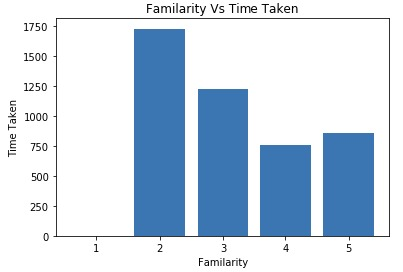
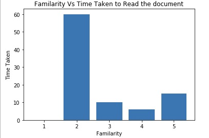
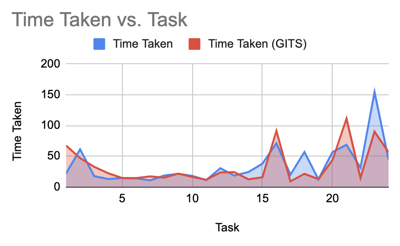
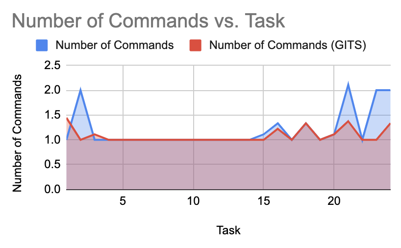
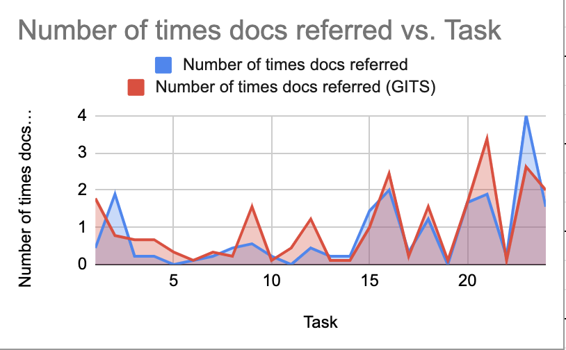

# Phase 3 - Experiments
We hosted total 10 experiments. Each experiment session was attended by 2 session hosts and 1 lab rat.  
Duties of the session hosts were as follows:  
* Primary Host: Guide the whole session, resolve any issues and answer lab rat's question. Primary host was also responsible for time tracking of task being performed.
* Secondary Host: Responsible for taking other manual obeservations explained in the later sections.

# Methods
Each participant was given a repository by the person hosting the session. We defined the set of tasks to be performed on that repository in each experiment. 
* ### General tasks
1. Clone the given repo
2. Add Your username and Email to the git configuration
3. Create Branch “branch1”.
4. Switch to main branch
5. Create Branch “branch2”
6. Switch to branch “branch1”
7. Show branches
* ### Branch1 tasks
8. Create file “test1.txt” and add `"hello test1"` in file
9. Stage the “test1.txt” file
10. Create file “test2.txt” and add `"hello test2"` in file
11. Stage the “test2.txt” file
12. Commit the changes and add `"my first commit"` commit message to it
13. Change the content of “test2.txt”  file from `"hello test2"` to `"hello test2 new"`.
14. Stage the file “test2.txt”.
15. Unstage the file “test2.txt”.
16. Remove the uncommitted changes made to the file “test2.txt”.
17. Switch to main branch.
18. Merge the branch branch1 to main branch. Push the main branch to remote.
* ### Branch2 tasks
19. Switch to branch “branch2”.
20. Make “branch2” upto date with local main branch.
21. (a) By this time, your remote main branch is updated by the host of your session. If not, confirm with the host.
21. (b) Make “branch2” upto date with remote main branch.
* ### Main branch tasks
22. Switch to main branch
23. Delete the latest 1 commit from local as well as remote “main” branch
24. Suppose you have messed up the repo. You want to delete the local repo and re-clone it. Do it.

It is important to note that participatns were asked to spend some time reading [Functionalities Implemented](https://github.com/cagandhi/GITS#functionalities-implemented) section on our repository before attending the lab trial. It would help the participants easily find the required information from GITS documentation when needed, during the experiment.

# It vs Not It
Each experiment was divided into 2 halves.

In the first half, participants perfomed the given set of tasks using **gits** command. While in the second half, same set of tasks were performed with just **traditional git** commands. 

The performance of each environment was measured using various metrics shown in Observations section.

# Materials
Althogh the installation scripts were provided by previous team for both windows and linux, we found some issues in installing and running GITS on windows. So, to make everyone's life easy, we created an AWS EC2 instance with GITS installed on it. We shared this instance with participants using Windows Operating System.

Each experiment's primary host created 2 repositories which were given to participants for experiment tasks. First repository was used to perform tasks using GITS and second was used to perform tasks using traditional git.

During the experiment, both hosts of the session used [this sheet](https://docs.google.com/spreadsheets/d/1TjId2aKsg8f3ZnINB_9Pzy2hobA9Zbp03Rxmql2CnzU/edit?usp=sharing) to take manual observations.

At the end of the experiment, participants were asked to fill out [this google form](https://forms.gle/pLK6DoUsfJRAG74G7)

# Observations
### Manual observations
This information is collected on a manual basis by the host conducting the experiment. This data corresponds to each of the tasks assingned to the participant using both GITS and Git individually.
* Time taken by the participant to finish a particular task.
* Number of (GITS/Git) commands used to complete the task.
* Number of times the participant glanced at documentation while performing the task.

 ### Automated observations
 This information relates to the [form](https://forms.gle/pLK6DoUsfJRAG74G7) filled by participants at the end of the experiments.
 * Token id
 * Fimiliarty witbh Git
 * Time spent by them before the experiment for going through the GITS documentation.
 * Tasks which they found most difficult to perform.
 
# Statistical Analysis
Based on the details we stored from our experiments, following is analysis of these trials.

    
We can see in the above graph that time taken for an individual with less familarity takes more time whereas for individuals with more familarity takes less time to complete the experiment which is justifiable as the individual witth less experience will have to look at documentation more number of times as compared to more experience individual.  
    
  In the above graph we can see that unfamilar individual spent more time before hand for reading the documentation and more familar individual hardly spent any time looking at the documentation. This shows that gits and git have highly similar functionalities and function names.  
    
  It can be seen that time taken for performing gits or git task is similar at most of the places where at some places time taken for performing task in git was less as compared to gits. This explains that due to the unfamilarity with gits functions, some task may take longer than git if person is familar with git.  
    
  On the other hand we can see that the number of commands executed for gits are lower than git for performing individual tasks which says that gits has many of the regular used group of methods aggregated into one making it easy for individual to use it.  
    
  Individual has referred the doc almost equal numnbero of times for both gits and git for the task list. This states that documentation is highly detailed for both of them because on an average for performing a task individual has referred document only once.
  

# Conclusion

# Threats to validity
- The understanding of Git for each participant may be different which may result in the difference in the taken to complete the experiment.
- To efficiently use the proposed tool prior knowledge of tool was required. The difference in the knowledge of various command provided by the tool may result in the different results.
- The conclusion is derived based on the participation of 10 participants which is not sufficient to conclude the success of the tool.
- The participant of this experiment does not belong to diverse community. All the participants were having similar background and experience which add bias in the result.
- The experiment does not consider all the possible operations performed by the tool. It may be possible that the results obtained for the experiment are specific to task performed during experiment and may change when larger domain of operations is considered.

